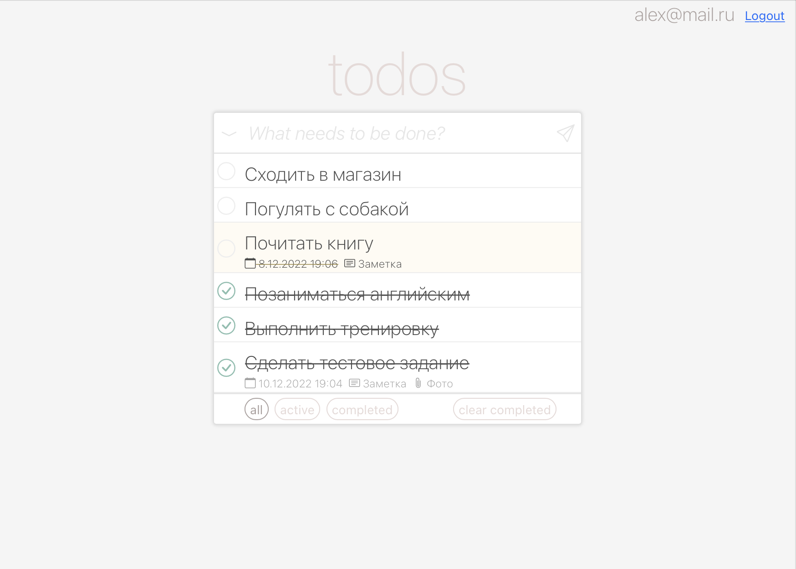
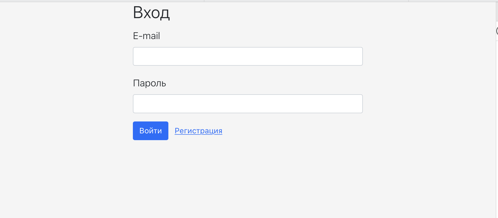

# Todo app
Frontend of this project was generated with [ReactJs](https://reactjs.org) version 18.2.0

Backend of this project was generated with [firebase](https://firebase.google.com)
## Run
To start the project, follow these steps:
1. download the project files
2. navigate to the root folder of the project in the terminal
3. run the following commands in terminal
   > npm install

   > npm start

4. open the project in the browser by following the link: http://localhost:3000

## Preview
Main Page

Auth Page

